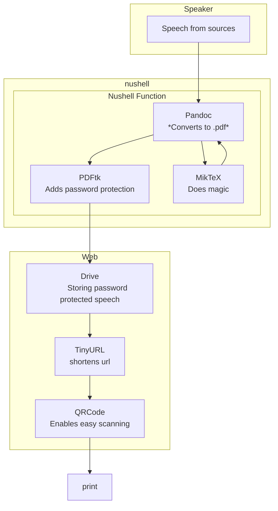

Recently I was attending a wedding, where the groom and bride were from Germany and Denmark. They wanted family and friends to be able to follow along in the speeches, no matter what language the speeches were spoken in. The tricky part was that the bride and groom also wanted to ensure that the guests should not be able to read / peak ahead. I thought about this. But because it was one of my best friends, I thought **a lot** about it.


*Not the speech in question, simply some neatly arranged pixels to look at*

### Problem definition
- Share speeches as text
- Audience not read ahead
- Be somewhat user friendly
- Not spending millions on printer ink (yes, I know I should get another printer with powder).

## Solution design
### Printing the speeches 
**TLDR; Not a viable option**. The first thought is of course to translate each speech into Danish, German or English and then print x amount of speeches and distribute right before each speech. But that would be a logistical nightmare. I had to make a table like this to figure out how many versions of each speech I would need to print.

| ****               | **Printed English** | **Printed German** | **Printed Danish** |
|:------------------:|:-------------------:|:------------------:|:------------------:|
| **Spoken English** | 0                   | 5                  | 3                  |
| **Spoken German**  | 30                  | 0                  | 20                 |
| **Spoken Danish**  | 35                  | 35                 | 0                  |


It was based on what language it was being spoken in and what language it was being printed in. Meaning that a speech being held in danish would need eg 20 German prints and 10 English prints, as neither Germans nor americans speak Danish. Whereas a speech held in English would maybe only need 3 Danish versions and 5 German versions, as Germans and Danes generally understand English very well. 

Upon inspecting this, and doing some math. We can calculate that each danish speech of 2 pages written text would need 70 printed versions totalling 140 pages. <mark>Mathematically that is a big number</mark>. Knowing that there could be more than one speech at a wedding, in this case nine, that would quickly add up to 54.000. Okay maybe not, but I was too lazy to do the math. Also the numbers in the table is exaggerated for dramatic effect. But you get the point, it is not a viable option.

### QR codes
Maybe I could make a QR code that linked to the speech. Well yes, but also no. Simply making a QR code that links to the speech will allow everyone to read ahead. But this is where I had a big brain moment. I could maybe make the speeches into password protected pdfs. After a quick test, this was the obvious solution, and the steps was relatively straight forward.

### Solution
I am in a period where I really enjoy working from command-line. It's a long period. I have an affinity for commandline. 


### The implementation
Below you see the nushell script. I realize it makes a pretty weird temp name. But it works, so why fix?
```nu
def secure-pdf [input: string, output: string, password: string] {
let temp = $"($output)-temp.pdf"

pandoc $input -o $temp -V documentclass=extarticle -V fontsize=20pt -V geometry:margin=1.5cm

pdftk $temp output $output user_pw $password

rm $temp
}
```


The usage is basically
```sh
secure-pdf 'speech_german.docx' german.pdf radio
```

### Choosing a <input value="password" type="password">

Given that the languages spoken were German, Danish and English, I asked ChatGPT to list all overlapping words in those languages. This enabled me to pick simple passwords that no one would have a hard time spelling. Below you will find a delightfully redundant table.

| English   | German       | Danish       |
|-----------|--------------|--------------|
| Cola      | Cola         | Cola         |
| Taxi      | Taxi         | Taxi         |
| Radio     | Radio        | Radio        |
| Hotel     | Hotel        | Hotel        |
| Computer  | Computer     | Computer     |
| Bank      | Bank         | Bank         |
| Bus       | Bus          | Bus          |
| Film      | Film         | Film         |
| Park      | Park         | Park         |
| Restaurant| Restaurant   | Restaurant   |

### Finishing touch
After this it was simply uploading the pdf's to google drive, setting each share link to 'everyone has access' and feed that link into [tinyurl](https://tinyurl.com/) to get a smaller url and a more easily recognizable QR code.
